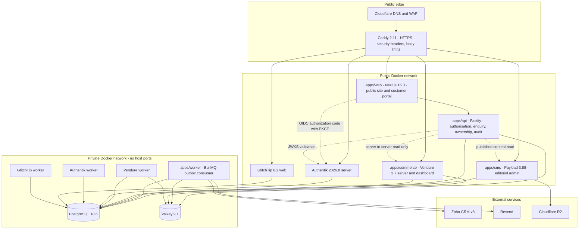
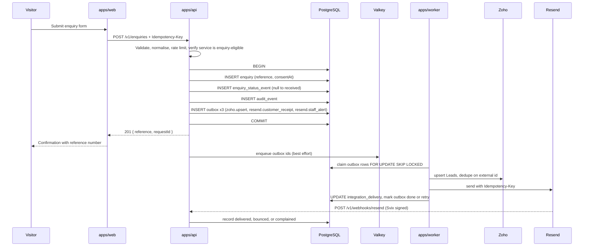

# CERA Medical Architecture

Implements PRD section 9. Versions are the current stable releases verified against official
documentation in September 2026.

---

## 1. Runtime topology



Two deliberate departures from the PRD's `apps/` listing, both recorded in
[adr/ADR-003-api-worker-split.md](adr/ADR-003-api-worker-split.md):

- **`apps/api`** concentrates every authorisation and record-ownership decision in one auditable
  server layer, so PRD 1.2 ("every protected route enforces role and record ownership on the
  server") is satisfied in one testable surface rather than scattered across rendering code.
- **`apps/worker`** consumes a durable outbox, which is what PRD 8.1 requires of Zoho and Resend
  calls.

Authentik no longer uses Redis as of its 2025.10 release; it runs as server plus worker on
PostgreSQL alone. Plan for roughly 50% more Postgres connections than a Redis-backed deployment.

---

## 2. Repository structure

Follows PRD 9.2, extended for the two additional apps.

```
cera-platform/
  apps/
    web/          Next.js 16 - public site, customer portal, staff console
    cms/          Payload 3.88 - content models and editorial admin
    commerce/     Vendure 3.7 - service catalogue, server + worker + dashboard
    api/          Fastify - enquiry, customer, operations, claim, audit
    worker/       BullMQ - outbox consumer for Zoho, Resend, reconciliation
  packages/
    contracts/    Zod schemas, API types, status machines, fixtures
    db/           Drizzle schema, migrations, and pool factory for cera_app (ADR-009)
    ui/           design tokens and accessible components
    config/       shared ESLint, TypeScript, Prettier, Vitest config
    observability/ structured logging, request IDs, GlitchTip helpers
  infra/
    compose/      base, local, staging, production overlays
    caddy/        Caddyfile and security headers
    postgres/     init scripts for per-service databases and roles
    scripts/      deploy, migrate, backup, restore, health-check, smoke-test
  docs/
    adr/          architecture decisions
    runbooks/     deploy, rollback, backup, incident, access
    contracts/    human-readable API and data documentation
  .github/
    workflows/    ci, staging, release, security
    ISSUE_TEMPLATE/
    pull_request_template.md
  CODEOWNERS
  .env.example
  compose.yaml
  pnpm-workspace.yaml
  README.md
```

`.planning/` sits alongside and is the delivery breakdown; `docs/` is the shipped documentation.
ADRs are authored in `.planning/adr/` during delivery and copied to `docs/adr/` at Phase 15 handover.

---

## 3. Version matrix

All npm versions below were verified against the registry on 2026-09-21. The authoritative list is
the `catalog:` block in `pnpm-workspace.yaml`; this table is its narrative form.

| Component         | Version          | Notes                                                                                                                                                             |
| ----------------- | ---------------- | ----------------------------------------------------------------------------------------------------------------------------------------------------------------- |
| Node.js           | 24.21.0 LTS      | Active LTS and within every component's range. Payload's real floor is `>=20.9.0`, not 24.15 as first recorded - see [ADR-002](adr/ADR-002-node-24-payload-3x.md) |
| pnpm              | 10.28.2          | Workspace catalog, `--frozen-lockfile` in CI                                                                                                                      |
| Next.js           | 16.3.5           | App Router, `output: 'standalone'`, Turbopack default, `proxy.ts` replaces `middleware.ts`                                                                        |
| React             | 19.3.0           | Paired with `react-dom` and the matching `@types`                                                                                                                 |
| Payload CMS       | 3.90.1           | v4 is pre-alpha; stay on 3.x                                                                                                                                      |
| Vendure           | 3.7.3            | React Dashboard; Angular admin deprecated and unmaintained after July 2026                                                                                        |
| Tailwind CSS      | 4.3.3            | CSS-first `@theme`, `@tailwindcss/postcss`                                                                                                                        |
| Fastify           | 5.12.5           | `apps/api`, with helmet, cors, and rate-limit plugins                                                                                                             |
| Drizzle ORM / Kit | 0.45.3 / 0.31.11 | `packages/db` owns the `cera_app` schema and migrations; `apps/api` and `apps/worker` consume it (ADR-009)                                                        |
| Zod               | 4.6.5            | `packages/contracts`                                                                                                                                              |
| openid-client     | 6.8.8            | OIDC relying party                                                                                                                                                |
| jose              | 6.2.12           | JWE cookie sealing, JWKS verification                                                                                                                             |
| BullMQ            | 6.3.8            | Outbox and Vendure job queue, both on Valkey                                                                                                                      |
| Resend SDK        | 6.28.1           | With `svix` 2.5.0 for webhook verification                                                                                                                        |
| AWS S3 client     | 3.1136.0         | R2 and MinIO through the S3 API                                                                                                                                   |
| Pino              | 10.3.1           | Structured logging in `packages/observability`                                                                                                                    |
| Sentry SDK        | 10.75.0          | Reporting to self-hosted GlitchTip                                                                                                                                |
| PostgreSQL        | 18.6             | `PGDATA` is version-specific; mount the volume at `/var/lib/postgresql`                                                                                           |
| Valkey            | 9.1.2            | Drop-in for Redis OSS <= 7.2                                                                                                                                      |
| Authentik         | 2026.8.3         | server + worker + Postgres; no Redis since 2025.10                                                                                                                |
| Caddy             | 2.11.4           | Custom build with `caddy-dns/cloudflare` for DNS-01                                                                                                               |
| GlitchTip         | 6.2.6            | No session replay or profiling support                                                                                                                            |
| TypeScript        | 6.0.3            | Held below 7.0.2 until `typescript-eslint` supports it                                                                                                            |
| ESLint            | 9.39.5           | Held below 10.x for the same reason                                                                                                                               |
| Vitest            | 5.0.1            | With `@vitest/coverage-v8` 5.0.1                                                                                                                                  |
| Playwright        | 1.63.0           | With `@axe-core/playwright` 4.13.0                                                                                                                                |

---

## 4. Service and port map

Host ports are bound only for local development. In staging and production only Caddy publishes
80 and 443 (PRD INF-901).

| Service                         | Container port     | Local host port   | Public subdomain |
| ------------------------------- | ------------------ | ----------------- | ---------------- |
| Caddy                           | 80, 443            | 80, 443           | -                |
| `web`                           | 3000               | 3000              | `www` and apex   |
| `cms`                           | 3001               | 3001              | `admin`          |
| `commerce` server               | 3002               | 3002              | `catalogue`      |
| `commerce` worker               | -                  | -                 | -                |
| `api`                           | 3003               | 3003              | `api`            |
| `worker`                        | 3004 (health only) | 3004              | -                |
| Authentik server                | 9000               | 9000              | `auth`           |
| Authentik worker                | -                  | -                 | -                |
| GlitchTip web                   | 8080               | 8080              | `status`         |
| PostgreSQL                      | 5432               | 5432 (local only) | never            |
| Valkey                          | 6379               | 6379 (local only) | never            |
| MinIO (local R2 stand-in)       | 9001, 9002         | 9001, 9002        | never            |
| Mailpit (local Resend stand-in) | 1025, 8025         | 1025, 8025        | never            |

Every service exposes `GET /health` returning `{ status, version, checks }`. Compose healthchecks
gate dependents with `condition: service_healthy`, and one-shot migration containers gate apps with
`condition: service_completed_successfully`.

---

## 5. Databases

One PostgreSQL instance, five databases, five least-privilege roles. No role can reach another
database. Created by `infra/postgres/init/01-databases.sh`, which runs only against an empty data
directory.

| Database        | Role            | Owner of                                                                                                                |
| --------------- | --------------- | ----------------------------------------------------------------------------------------------------------------------- |
| `cera_app`      | `cera_app`      | enquiries, status events, internal notes, customer profiles, audit events, outbox, integration deliveries, claim tokens |
| `cera_cms`      | `cera_cms`      | Payload collections, versions, media metadata                                                                           |
| `cera_commerce` | `cera_commerce` | Vendure catalogue and job records                                                                                       |
| `authentik`     | `authentik`     | identities, groups, flows, sessions                                                                                     |
| `glitchtip`     | `glitchtip`     | error events                                                                                                            |

Migrations are owned per app: Drizzle for `cera_app`, `payload migrate` for `cera_cms`, and
`vendure migrate` (TypeORM, `synchronize: false`) for `cera_commerce`. Payload's `push` mode is
permitted in local development only and never combined with `migrate`.

---

## 6. Enquiry data flow

The critical path. PRD 4.1 requires that the response is not delayed by Zoho or Resend, and PRD 8.1
requires that a successful local write is never lost when a provider is unavailable.



A Valkey outage degrades latency, not correctness: the worker also sweeps the outbox on a timer, so
enqueue failure is non-fatal. Retries use exponential backoff with jitter; exhausted rows move to a
dead-letter state that stays visible to operations, and `pnpm reconcile` replays them.

---

## 7. Authorisation flow

```mermaid
sequenceDiagram
  participant U as User
  participant W as apps/web
  participant AK as Authentik
  participant A as apps/api

  U->>W: GET /account
  W->>W: No session cookie
  W->>AK: Redirect to authorize with PKCE, state, nonce
  U->>AK: Credentials, then TOTP for staff and admins
  AK-->>W: Redirect to callback with code
  W->>AK: Exchange code at token endpoint
  W->>AK: Verify id_token against JWKS, check nonce
  W->>W: Seal { sub, email, roles, exp } as a JWE httpOnly cookie
  W->>A: Request with sealed session forwarded
  A->>A: Unseal, re-derive role, apply ownership filter
  A->>A: Deny by default; log the decision with a request id
  A-->>W: Customer-safe projection only
```

Roles originate as Authentik groups, surfaced in the token by an OAuth2 Scope Mapping on a `groups`
scope, then mapped to the seven PRD roles. Authorisation is evaluated **per request in `apps/api`**,
never in `proxy.ts` alone - Next.js middleware-only gating has a documented fail-open failure mode.

| Authentik group          | PRD role                      |
| ------------------------ | ----------------------------- |
| `cera-customers`         | Customer                      |
| `cera-content-editors`   | Content Editor                |
| `cera-content-approvers` | Content and Clinical Approver |
| `cera-operations`        | Operations Support            |
| `cera-administrators`    | Administrator                 |
| `cera-product-owner`     | CERA Product Owner            |
| `cera-release-approvers` | Technical Release Approver    |

Session lifetimes: customers 12 hours idle / 7 days absolute; staff and administrators 60 minutes
idle / 8 hours absolute, with MFA required at sign-in.

---

## 8. Environment matrix

Implements PRD 9.1.

|                | Local                                 | Staging                      | Production                                                  |
| -------------- | ------------------------------------- | ---------------------------- | ----------------------------------------------------------- |
| Trigger        | feature branch                        | merge to `develop`           | approved `v*` tag on `main`                                 |
| Host           | developer machine                     | Hetzner CX33 or equivalent   | Hetzner CX43 or equivalent                                  |
| Images         | built from source                     | GHCR, tagged with commit SHA | GHCR, promoted by digest                                    |
| Compose        | `compose.yaml` + `compose.local.yaml` | `+ compose.staging.yaml`     | `+ compose.production.yaml`                                 |
| Object storage | MinIO                                 | R2 staging bucket            | R2 production bucket                                        |
| Email          | Mailpit                               | Resend test domain           | Resend verified domain                                      |
| CRM            | fake driver                           | Zoho sandbox                 | Zoho production                                             |
| OIDC           | local Authentik client                | staging client               | production client                                           |
| Secrets        | `.env.local`, git-ignored             | GitHub staging environment   | GitHub production environment, released only after approval |
| Data           | synthetic fixtures                    | synthetic fixtures           | CERA data, backups, deletion protection                     |

Server sizes are procurement assumptions, not performance guarantees. Phase 14 records CPU, memory,
disk, connection count, latency, and error rate under staging load, and resizing before launch is a
valid outcome (PRD 9.1).

---

## 9. Non-functional budgets

Derived from PRD section 10 and verified in Phase 14.

| Area          | Budget                                                              | How it is verified                                                                                              |
| ------------- | ------------------------------------------------------------------- | --------------------------------------------------------------------------------------------------------------- |
| Availability  | 99.5% monthly                                                       | Health checks across web, APIs, workers, database, disk                                                         |
| Performance   | p75 LCP <= 2.5s mobile; API p95 < 800ms excluding provider latency  | Lighthouse on throttled mobile; API latency histogram                                                           |
| Database      | no unbounded queries                                                | Every list endpoint has a mandatory limit; `EXPLAIN` review on the enquiry queue                                |
| Accessibility | WCAG 2.2 AA                                                         | axe automated plus manual keyboard, focus, label, status, contrast, 200% zoom, 400% reflow, screen-reader smoke |
| Security      | OWASP Top 10 2025                                                   | Access-control tests, dependency review, secret scan, container scan, header check                              |
| Recovery      | RPO 24h, RTO 4h                                                     | Timed restore rehearsal recorded in Phase 13                                                                    |
| Observability | request id on every request; release and environment on every error | GlitchTip event inspection with PII scrubbing assertions                                                        |

---

## 10. Trust boundaries

1. **Browser to Caddy.** TLS terminates at Caddy. Inbound `X-Forwarded-*` is discarded and
   regenerated; `trusted_proxies` is set globally so client-IP parsing is correct.
2. **`apps/web` to `apps/api`.** The web app is a consumer, not a trusted authority. It forwards the
   sealed session and the API re-derives everything. A compromised rendering layer cannot escalate.
3. **`apps/api` to Vendure and Payload.** Server-to-server only, on the private network. The Shop
   API and the Payload REST API are never reachable from a browser, which is one of the three layers
   neutralising Vendure checkout.
4. **`apps/worker` to external providers.** The only component holding Zoho and Resend credentials.
   No provider credential is readable by `apps/web`.
5. **Media.** R2 credentials live in `apps/cms` and `apps/worker`. Browsers receive public delivery
   URLs or short-lived presigned URLs, never credentials. Presigned URLs are treated as bearer
   tokens with minimal scope and expiry.
