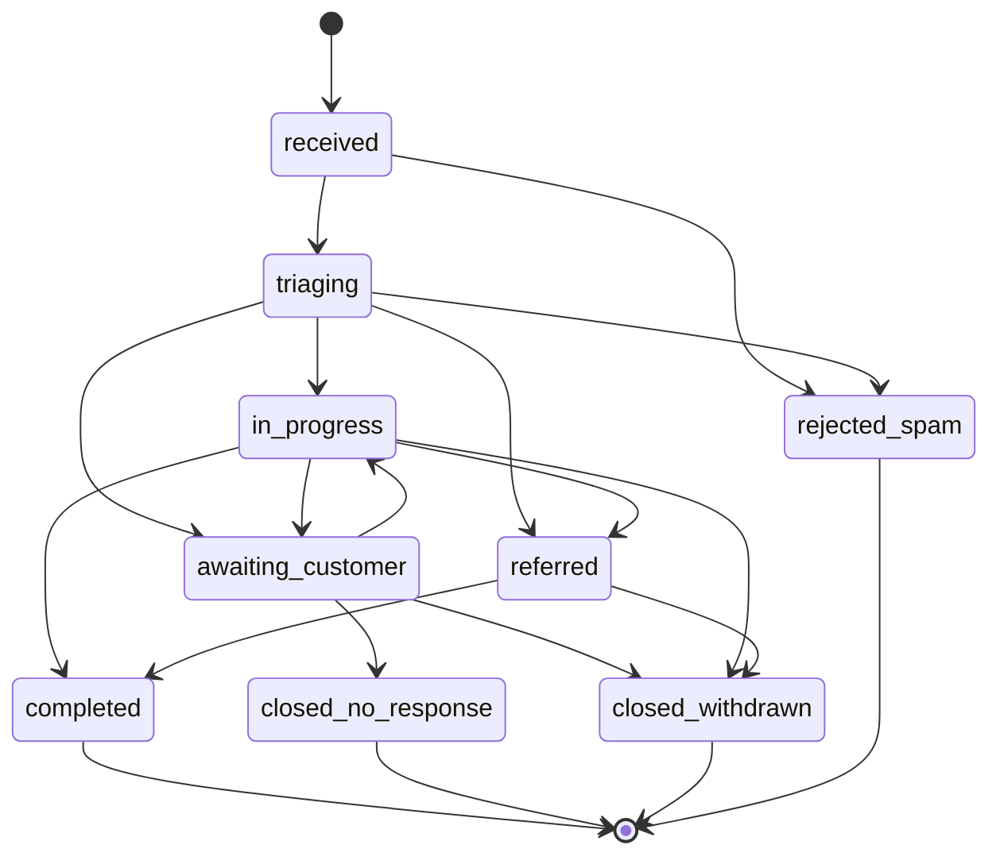

# CERA Medical Data Contracts

Implements PRD section 8. Contracts live in `packages/contracts` and are imported by producers,
consumers, mocks, and tests, so a breaking change fails a build rather than a production request.

---

## 1. Contract rules

From PRD 8.1, binding on every phase:

1. `packages/contracts` is the single source of truth. `apps/api` derives its route schemas from it,
   `apps/web` derives its client types from it, and fixtures are generated from it.
2. Every endpoint returns a request ID and, on failure, the stable error envelope in section 3.
   Stack traces never leave the server.
3. Breaking changes require a new issue, agreement between the web and API owners, migration notes,
   and updated fixtures **before** implementation.
4. External calls go through the outbox. A successful local write is never lost because a provider
   is down.

Naming: `camelCase` in JSON and TypeScript, `snake_case` in PostgreSQL, with Drizzle mapping between
them. Timestamps are UTC ISO 8601 with milliseconds. IDs are UUID v7 so they sort by creation time.

---

## 2. Entities

The eight entities of PRD 8, with the ownership and exposure rules that make them safe.

### 2.1 Service

Owned by Vendure. Read-only downstream; `apps/api` caches the projection but never writes it.

```ts
export const ServiceSchema = z.object({
  id: z.string().min(1),
  slug: z.string().regex(/^[a-z0-9]+(?:-[a-z0-9]+)*$/),
  category: z.object({ id: z.string(), slug: z.string(), title: z.string() }).nullable(),
  title: z.string().min(1).max(160),
  summary: z.string().max(320),
  description: z.string(),
  displayPrice: z.string().nullable(), // presentational text, never a transactable amount
  availabilityText: z.string().nullable(),
  enquiryEnabled: z.boolean(),
  mediaId: z.string().nullable(),
  status: z.enum(['active', 'inactive']),
  createdAt: z.string().datetime(),
  updatedAt: z.string().datetime(),
});
```

`displayPrice` is a string, not a number, so it can never be mistaken for a chargeable amount. The
public API returns active services only; Vendure's Shop API already filters disabled records
server-side. `id` and `slug` are stable contracts referenced by enquiries and CMS presentation
records, so changing a slug requires a redirect entry.

### 2.2 ContentDocument

Owned by Payload.

```ts
export const ContentDocumentSchema = z.object({
  id: z.string(),
  type: z.enum(['page', 'post', 'policy', 'servicePresentation']),
  slug: z.string(),
  title: z.string().min(1).max(200),
  excerpt: z.string().max(400).nullable(),
  body: z.unknown(), // Lexical AST, validated by Payload
  seo: z.object({
    title: z.string().max(70).nullable(),
    description: z.string().max(180).nullable(),
    canonicalUrl: z.string().url().nullable(),
    ogImageId: z.string().nullable(),
    noIndex: z.boolean().default(false),
  }),
  mediaIds: z.array(z.string()),
  status: z.enum(['draft', 'published']),
  authorId: z.string().nullable(),
  approverId: z.string().nullable(),
  publishedAt: z.string().datetime().nullable(),
  createdAt: z.string().datetime(),
  updatedAt: z.string().datetime(),
});
```

Public reads return `status: 'published'` only. Draft access requires an authenticated preview
session. Access control returns a **query constraint**, not a boolean, so the restriction cannot be
bypassed by requesting drafts directly.

### 2.3 Enquiry

Owned by `cera_app`. The most sensitive record in the release.

```ts
export const EnquirySchema = z.object({
  id: z.string().uuid(),
  reference: z.string().regex(/^CERA-[0-9]{6}-[A-Z0-9]{5}$/),
  customerSubjectId: z.string().nullable(),
  name: z.string().min(2).max(120),
  email: z.string().email().max(254),
  phone: z.string().min(7).max(24).nullable(),
  serviceId: z.string().min(1),
  message: z.string().min(10).max(2000),
  consentAt: z.string().datetime(),
  source: z.enum(['web_service_page', 'web_contact_page', 'web_general']),
  internalStatus: InternalStatusSchema,
  ownerId: z.string().nullable(),
  createdAt: z.string().datetime(),
  updatedAt: z.string().datetime(),
});
```

- `reference` is immutable and generated once: `CERA-YYMMDD-` plus five Crockford base32 characters
  from a CSPRNG, with a unique constraint and bounded retry on collision.
- `consentAt` is the server clock at the moment of a validated submission. A submission without
  consent is rejected; consent is never inferred or defaulted.
- `message` is capped at 2000 characters and is never logged, never sent to GlitchTip, and never
  placed in an alert body.
- `ownerId` and `internalStatus` are staff-only and absent from every customer projection.
- **No field exists for clinical history, diagnosis, medication, or document upload.** This is a
  schema-level guarantee of PRD 3.2, not a policy.

### 2.4 EnquiryStatusEvent

Append-only. No update or delete path exists in code.

```ts
export const EnquiryStatusEventSchema = z.object({
  id: z.string().uuid(),
  enquiryId: z.string().uuid(),
  previousStatus: InternalStatusSchema.nullable(),
  newStatus: InternalStatusSchema,
  customerStatus: CustomerStatusSchema,
  actorSubjectId: z.string().nullable(), // null for system transitions
  reason: z.string().max(500).nullable(), // staff-only, never projected to the customer
  createdAt: z.string().datetime(),
});
```

### 2.5 InternalNote

Staff-only. Never included in a customer, public, or Zoho payload.

```ts
export const InternalNoteSchema = z.object({
  id: z.string().uuid(),
  enquiryId: z.string().uuid(),
  authorSubjectId: z.string(),
  body: z.string().min(1).max(4000),
  createdAt: z.string().datetime(),
  editedAt: z.string().datetime().nullable(),
});
```

Enforced three ways: no customer route selects the table; the Zoho payload builder takes an explicit
allow-list of fields rather than spreading a record; and a contract test asserts that the serialised
customer and CRM payloads contain none of the note bodies present in the fixture set.

### 2.6 IntegrationDelivery

Operations and administrators only.

```ts
export const IntegrationDeliverySchema = z.object({
  id: z.string().uuid(),
  enquiryId: z.string().uuid(),
  provider: z.enum(['zoho', 'resend']),
  eventType: z.enum([
    'zoho.lead.upsert',
    'resend.customer.receipt',
    'resend.staff.alert',
    'resend.status.update',
  ]),
  idempotencyKey: z.string().min(8).max(256),
  externalId: z.string().nullable(),
  attempt: z.number().int().min(0),
  status: z.enum(['pending', 'in_flight', 'succeeded', 'failed', 'dead_letter']),
  responseCode: z.number().int().nullable(),
  errorClass: z.string().max(120).nullable(),
  createdAt: z.string().datetime(),
  updatedAt: z.string().datetime(),
});
```

`errorClass` holds a classification such as `rate_limited` or `auth_failed`, never a raw provider
body, because provider errors echo request content. Tokens are never stored on this record.

`idempotencyKey` is `{eventType}/{enquiryId}` for first-delivery events. Resend retains keys for 24
hours, so retries beyond that window rely on the local `status` instead, which is why the local
record is authoritative and the provider key is a second line of defence.

### 2.7 CustomerProfile

Keyed by the Authentik subject. There is no local password field; Authentik owns credentials.

```ts
export const CustomerProfileSchema = z.object({
  subjectId: z.string().min(1),
  email: z.string().email(),
  displayName: z.string().min(1).max(120),
  phone: z.string().min(7).max(24).nullable(),
  emailVerifiedAt: z.string().datetime().nullable(),
  createdAt: z.string().datetime(),
  updatedAt: z.string().datetime(),
});
```

A customer may update `displayName` and `phone`. `email` changes only through Authentik, because it
is the key that governs enquiry claiming. `emailVerifiedAt` must be non-null before any claim
succeeds.

### 2.8 AuditEvent

Append-only administrative evidence with personal data minimised.

```ts
export const AuditEventSchema = z.object({
  id: z.string().uuid(),
  actorSubjectId: z.string().nullable(),
  action: z.string().max(80), // e.g. 'enquiry.status.changed'
  targetType: z.enum(['enquiry', 'content', 'customer', 'service', 'user', 'release']),
  targetId: z.string(),
  safeDiff: z.record(z.string(), z.object({ from: z.unknown(), to: z.unknown() })).nullable(),
  requestId: z.string(),
  createdAt: z.string().datetime(),
});
```

`safeDiff` passes through a redactor with a field allow-list. Free-text fields (`message`, note
bodies, transition reasons) are recorded as `{ changed: true }` rather than by value.

### 2.9 EnquiryClaimToken

Not enumerated in PRD 8 but required by CUS-601, so it is a first-class contract.

```ts
export const EnquiryClaimTokenSchema = z.object({
  id: z.string().uuid(),
  enquiryId: z.string().uuid(),
  emailHash: z.string().length(64), // SHA-256 of the normalised email, never the address
  tokenHash: z.string().length(64), // SHA-256 of the token; the token itself is never stored
  expiresAt: z.string().datetime(), // issued + 30 minutes
  consumedAt: z.string().datetime().nullable(),
  consumedBySubjectId: z.string().nullable(),
  createdAt: z.string().datetime(),
});
```

Single-use and short-lived. Claiming requires that the authenticated subject's verified email hash
equals `emailHash`, so one account can never claim another address's enquiry. A reused or expired
token returns the same generic failure as an unknown token, so the endpoint cannot be used to probe
which references exist.

### 2.10 Outbox

```ts
export const OutboxRecordSchema = z.object({
  id: z.string().uuid(),
  aggregateType: z.literal('enquiry'),
  aggregateId: z.string().uuid(),
  eventType: z.string(),
  payload: z.unknown(), // minimised; references ids, not full records
  availableAt: z.string().datetime(),
  attempts: z.number().int().min(0),
  lockedAt: z.string().datetime().nullable(),
  lockedBy: z.string().nullable(),
  status: z.enum(['pending', 'in_flight', 'done', 'dead_letter']),
  lastError: z.string().max(200).nullable(),
  createdAt: z.string().datetime(),
});
```

Written in the same transaction as the enquiry. Claimed with
`FOR UPDATE SKIP LOCKED` so multiple workers never double-process a row.

---

## 3. Error envelope

Every non-2xx response from `apps/api`, with no exceptions.

```ts
export const ErrorEnvelopeSchema = z.object({
  error: z.object({
    code: ErrorCodeSchema,
    message: z.string(), // safe for display; no internals, no SQL, no stack
    retryable: z.boolean(),
    fieldErrors: z
      .array(
        z.object({
          path: z.string(), // dot path, e.g. 'email'
          code: z.string(), // e.g. 'invalid_email'
          message: z.string(),
        }),
      )
      .optional(),
  }),
  requestId: z.string(),
});
```

```ts
export const ErrorCodeSchema = z.enum([
  'validation_failed', // 400, not retryable
  'unauthenticated', // 401, not retryable
  'forbidden', // 403, not retryable
  'not_found', // 404, not retryable
  'conflict', // 409, not retryable
  'invalid_transition', // 409, not retryable
  'consent_required', // 422, not retryable
  'rate_limited', // 429, retryable
  'upstream_unavailable', // 502, retryable
  'internal_error', // 500, retryable
]);
```

`not_found` and `forbidden` are deliberately indistinguishable for records the caller does not own:
an enquiry belonging to another customer returns `not_found`, so the API is not an existence oracle.

Success responses carry the request ID in both the body envelope and an `X-Request-Id` header. The
same ID appears in structured logs and in GlitchTip, which is how an operator correlates a user
report to a trace.

---

## 4. Status machines

Two vocabularies. Internal status drives operations; customer status is what a customer may see.
They are separate types so a staff-only value cannot leak by assignment (PRD ENQ-403).

### 4.1 Internal status

```ts
export const InternalStatusSchema = z.enum([
  'received',
  'triaging',
  'awaiting_customer',
  'in_progress',
  'referred',
  'completed',
  'closed_no_response',
  'closed_withdrawn',
  'rejected_spam',
]);
```



The five terminal states accept no outgoing transition. Any request for an edge absent from this
diagram returns `invalid_transition`; the transition table is a data structure in
`packages/contracts`, so the machine and its tests cannot drift.

### 4.2 Customer status

```ts
export const CustomerStatusSchema = z.enum([
  'received',
  'in_review',
  'action_needed',
  'in_progress',
  'completed',
  'closed',
]);
```

| Internal             | Customer        | Customer-facing label    |
| -------------------- | --------------- | ------------------------ |
| `received`           | `received`      | Enquiry received         |
| `triaging`           | `in_review`     | Under review             |
| `awaiting_customer`  | `action_needed` | We need a reply from you |
| `in_progress`        | `in_progress`   | In progress              |
| `referred`           | `in_progress`   | In progress              |
| `completed`          | `completed`     | Completed                |
| `closed_no_response` | `closed`        | Closed                   |
| `closed_withdrawn`   | `closed`        | Closed                   |
| `rejected_spam`      | `closed`        | Closed                   |

`referred` collapses into `in_progress` and the three closure reasons collapse into `closed`, so a
customer can never infer an internal judgement. The mapping is exhaustive and total: a new internal
status will not compile until it is mapped.

---

## 5. Projections

Three projections of the same enquiry. Each is produced by an explicit builder that takes named
fields; none is produced by spreading a record, because a spread is how a new sensitive field leaks
on the day it is added.

```ts
// Customer: what the owning, verified customer sees
export const CustomerEnquirySchema = z.object({
  reference: z.string(),
  serviceTitle: z.string(),
  submittedAt: z.string().datetime(),
  status: CustomerStatusSchema,
  statusLabel: z.string(),
  updatedAt: z.string().datetime(),
  timeline: z.array(
    z.object({
      status: CustomerStatusSchema,
      label: z.string(),
      at: z.string().datetime(),
    }),
  ),
});
```

No `id`, `internalStatus`, `ownerId`, `message`, `email`, `phone`, note, or CRM field.
The timeline is built from status events with `customerStatus` de-duplicated, so consecutive
internal moves that map to one customer status appear as a single entry.

```ts
// Staff: the operations queue and detail view
export const StaffEnquirySchema = EnquirySchema.extend({
  serviceTitle: z.string(),
  ownerDisplayName: z.string().nullable(),
  noteCount: z.number().int(),
  lastIntegrationStatus: z.enum(['pending', 'succeeded', 'failed', 'dead_letter']).nullable(),
});
```

```ts
// Zoho: the CRM payload, deliberately minimal
export const ZohoLeadPayloadSchema = z.object({
  Last_Name: z.string(),
  First_Name: z.string().optional(),
  Email: z.string().email(),
  Phone: z.string().optional(),
  Company: z.string(), // constant; Zoho requires it on Lead
  Lead_Source: z.string(),
  Description: z.string(), // the enquiry message, the only free text sent
  External_Lead_ID: z.string(), // the enquiry reference
  CERA_Service: z.string(),
  CERA_Status: z.string(), // customer status vocabulary, not internal
});
```

Zoho receives the **customer** status vocabulary, never the internal one, and never a note or an
internal actor identity.

---

## 6. Public API surface

`apps/api`, all paths under `/v1`. Auth column: `public`, `customer`, `staff`, `admin`.

| Method  | Path                               | Auth               | Purpose                                         |
| ------- | ---------------------------------- | ------------------ | ----------------------------------------------- |
| `GET`   | `/health`                          | public             | Liveness and dependency checks                  |
| `GET`   | `/v1/services`                     | public             | Active service list, filterable by category     |
| `GET`   | `/v1/services/:slug`               | public             | Single active service                           |
| `GET`   | `/v1/content/:type/:slug`          | public             | Published content document                      |
| `GET`   | `/v1/search`                       | public             | Published content and active services           |
| `POST`  | `/v1/enquiries`                    | public             | Create one enquiry; rate limited and idempotent |
| `POST`  | `/v1/enquiries/claim/request`      | customer           | Issue a claim token to the verified email       |
| `POST`  | `/v1/enquiries/claim/consume`      | customer           | Consume a single-use token                      |
| `GET`   | `/v1/me/profile`                   | customer           | Own profile                                     |
| `PATCH` | `/v1/me/profile`                   | customer           | Update `displayName`, `phone`                   |
| `GET`   | `/v1/me/enquiries`                 | customer           | Own enquiries, customer projection              |
| `GET`   | `/v1/me/enquiries/:reference`      | customer           | Own enquiry with timeline                       |
| `GET`   | `/v1/ops/enquiries`                | staff              | Queue with filters, sort, pagination            |
| `GET`   | `/v1/ops/enquiries/:id`            | staff              | Staff projection                                |
| `PATCH` | `/v1/ops/enquiries/:id/assign`     | staff              | Assign an owner                                 |
| `POST`  | `/v1/ops/enquiries/:id/transition` | staff              | Validated status transition                     |
| `GET`   | `/v1/ops/enquiries/:id/notes`      | staff              | Internal notes                                  |
| `POST`  | `/v1/ops/enquiries/:id/notes`      | staff              | Add an internal note                            |
| `GET`   | `/v1/ops/enquiries/:id/audit`      | staff              | Audit history                                   |
| `GET`   | `/v1/ops/deliveries`               | staff              | Integration deliveries and dead letters         |
| `POST`  | `/v1/ops/deliveries/:id/retry`     | admin              | Replay one delivery                             |
| `POST`  | `/v1/webhooks/resend`              | public + signature | Svix-verified delivery events                   |

Every list endpoint has a mandatory server-enforced limit (default 25, maximum 100) and cursor
pagination, satisfying the "no unbounded database queries" budget. Rules that hold across the whole
surface: deny by default; `/v1/me/*` filters by the authenticated subject in the SQL `WHERE` clause
rather than after fetching; `/v1/ops/*` requires a staff role and re-checks it per request; and
every mutation writes an `AuditEvent` in the same transaction as the change.

---

## 7. Fixtures

Versioned alongside the contracts so each app can be built before its dependencies exist (PRD 16.1).

- Six services matching the reference image, one deliberately `enquiryEnabled: false` and one
  `inactive`, so exclusion logic is provably tested.
- Three articles, one page, two policies, plus one draft of each type to prove drafts stay private.
- Twelve enquiries spanning every internal status, including two terminal, one unclaimed, one
  claimed, one with three notes, and one with a dead-lettered Zoho delivery.
- Seven users, one per role, plus one customer with an unverified email to test the claim guard.
- Claim tokens: one valid, one expired, one already consumed.

All people are synthetic, phone numbers come from reserved example ranges, and messages are
non-sensitive. Every fixture carries `__fixture: true`, and a test asserts that no fixture-marked
record can exist in a production database.
