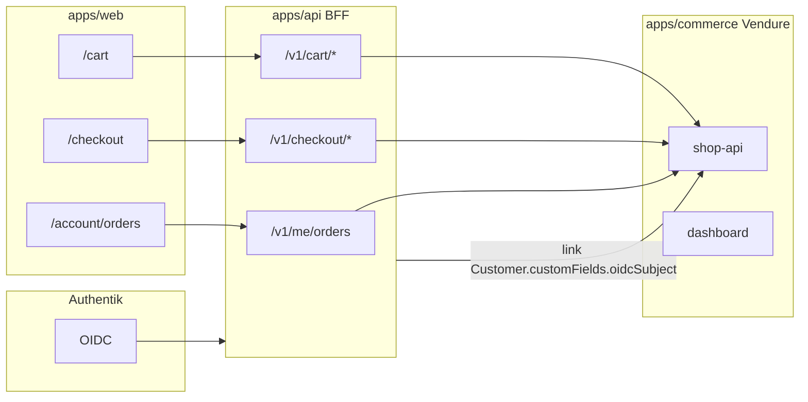

# E-commerce enablement programme (cart, checkout, accounts)

**Status:** Approved (2026-10-04) — supersedes [ADR-005](adr/ADR-005-vendure-checkout-neutralisation.md) when `CHECKOUT_ENABLED=true`.

**Current repo reality:** Vendure is a **read-only catalogue** for the public site. Checkout is blocked in three layers (empty payment handlers, GraphQL validation deny-list, Shop API not browser-exposed). Customer **accounts** exist via Authentik OIDC (`/account`) for **enquiries only**, not orders.

**Goal:** Production-grade **browse → cart → checkout → paid order → order history in account**, with staff fulfilment in Vendure.

---

## Decisions required before engineering

| Decision                      | Why it blocks build                                                                                                                                                            |
| ----------------------------- | ------------------------------------------------------------------------------------------------------------------------------------------------------------------------------ |
| **PRD / compliance sign-off** | PRD 3.2 explicitly excludes payments, checkout, invoicing, stored payment data. Medical/research services may need separate commercial and regulatory review for online sales. |
| **Payment provider**          | Stripe (international cards), PayFast/JazzCash (Pakistan), or manual “pay by invoice” only. Vendure needs a `PaymentMethodHandler` + webhooks.                                 |
| **What is purchasable**       | Fixed-price SKUs vs “from £X” display-only with quote-after-enquiry. Research services often cannot be one-click buy.                                                          |
| **Tax & invoicing**           | GST/sales tax, PDF invoices, ERPNext sync for orders (today: enquiry → CRM only).                                                                                              |
| **Shipping / fulfilment**     | Digital deliverables only vs physical kits; Vendure shipping methods.                                                                                                          |
| **Guest checkout**            | Allowed or sign-in required (OIDC already exists).                                                                                                                             |

---

## Target architecture

**Security (replacing ADR-005 layer 3):** Shop API stays **server-to-server** from `apps/api` only. Cart/checkout mutations never call Vendure from the browser. Session cookie binds guest cart; authenticated users merge cart to Vendure `Customer` linked by OIDC `sub`.

---

## Phased delivery

### Phase A — Governance & env (1–2 days)

- [ ] CERA approves PRD change and ADR-005 supersession.
- [ ] Add `CHECKOUT_ENABLED` (default `false` in production until go-live).
- [ ] When enabled: remove deny rules + order interceptor; register payment handler (dev: test handler; prod: Stripe).
- [ ] Update contract test: skip “mutation rejected” when checkout enabled; add “mutation succeeds in dev” test.

### Phase B — API cart BFF (3–5 days)

- [ ] Extend `vendure-client` with active order mutations (`addItemToOrder`, quantities, remove line).
- [ ] `POST/GET/PATCH/DELETE /v1/cart` with HttpOnly cart token or server session.
- [ ] `POST /v1/checkout/*` — set addresses, shipping method, transition to payment.
- [ ] Map Vendure errors to `@cera/contracts` API errors (no GraphQL leakage).

### Phase C — Web UX (3–5 days)

- [ ] `/cart`, `/checkout` (Stitch-aligned UI, `@cera/ui`).
- [ ] “Add to cart” on service pages where `customFields.purchasable` (new Vendure field) is true.
- [ ] Header cart badge; empty/error states; a11y + e2e.

### Phase D — Identity & account (2–4 days)

- [ ] On login: `registerCustomerAccount` / link existing Vendure customer by email + `oidcSubject` custom field.
- [ ] `GET /v1/me/orders` + `/account/orders` list and detail (customer-safe projection, like enquiries).

### Phase E — Payments production (5–10 days)

- [ ] Stripe Payment Intents (or chosen provider) + Vendure handler.
- [ ] Webhooks: payment succeeded → order state; idempotency keys.
- [ ] Email receipts (Resend), GlitchTip monitoring, runbooks.

### Phase F — Ops & ERP (optional, 5+ days)

- [ ] Order → ERPNext (parallel to enquiry outbox).
- [ ] Staff order views in `/staff` or Vendure dashboard only.

---

## Estimated effort

| Scope                                           | Calendar (1 senior + review) |
| ----------------------------------------------- | ---------------------------- |
| MVP local cart + dummy payment + account orders | ~2–3 weeks                   |
| Production Stripe + compliance copy + ERP       | ~6–10 weeks                  |

---

## What not to do

- Re-expose `/shop-api` on the public internet (bypasses BFF auth and rate limits).
- Enable checkout in production without payment handler and webhook hardening.
- Treat `displayPrice` string as a charge amount without Vendure `Money` on variants.

---

## Next step for implementation in this repo

Reply with:

1. **Approved to supersede ADR-005** (yes/no).
2. **Payment provider** for production.
3. **Purchasable model** — all five services fixed price, subset only, or display price + enquiry remains default.

Then Phase A + B can land behind `CHECKOUT_ENABLED=false` until go-live.
